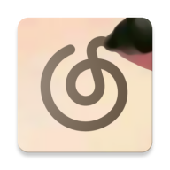

# NCM Matcher

Force Netease Cloud Music client to recognize a MP3/FLAC file as a user-specified song in NCM
library.
(Done by adding `163 key(Don't modify)` comment to meta)

Inspired by [nondanee/163marker](https://github.com/nondanee/163marker/) (also as the AES key
source).

While libncmapi module is licensed under MIT License
as [nondanee/163marker](https://github.com/nondanee/163marker/) does, other program files are
licensed under AGPL3. Image assets is published under CC BY-SA. The note logo is a trademark of
网之易信息技术（北京）有限公司.